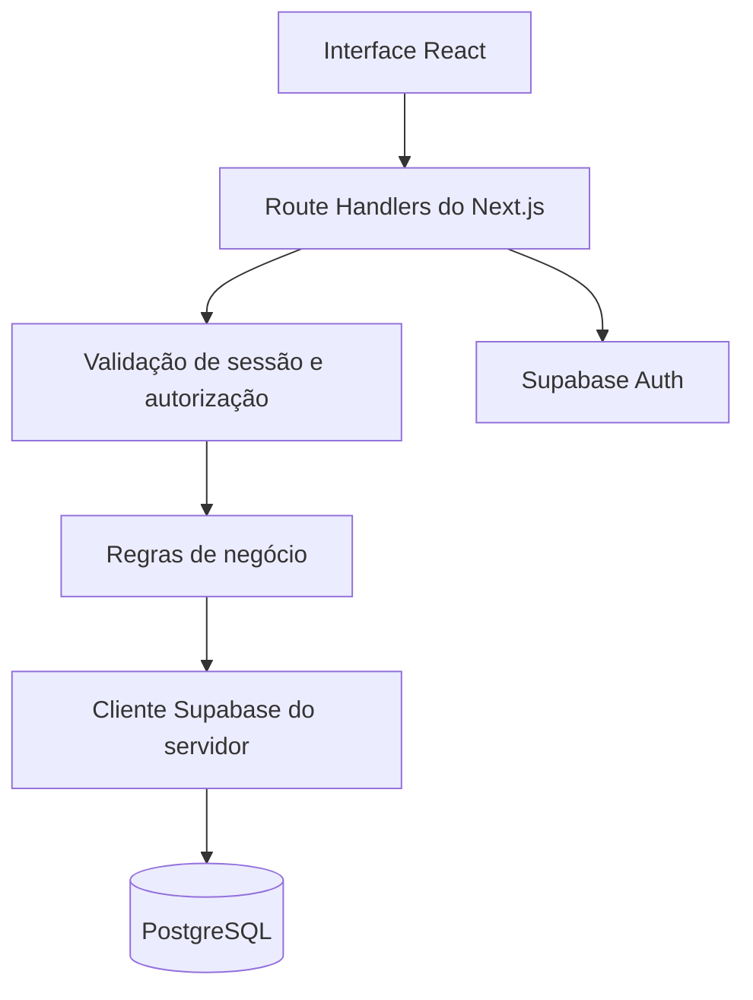
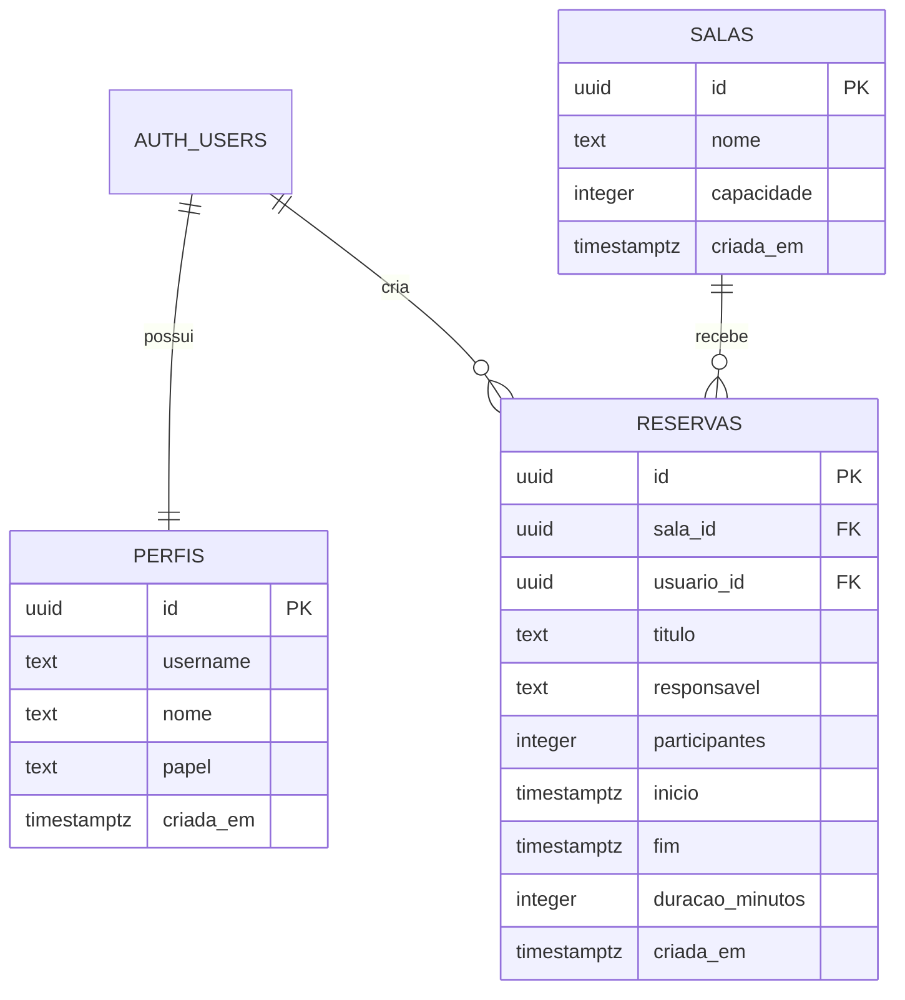

# Sistema de Reserva de Salas

Aplicação web full-stack para cadastro de salas e gerenciamento de reservas.

O projeto prioriza regras de negócio consistentes, validações no servidor, modelagem relacional, controle básico de acesso e uma interface responsiva com feedback claro ao usuário.

<p>
  <a href="https://sistema-reserva-salas-eight.vercel.app/"><strong>Acessar aplicação</strong></a>
  ·
  <a href="https://github.com/1Prode/sistema-reserva-salas"><strong>Repositório</strong></a>
</p>

---

## Visão geral

O sistema permite cadastrar salas e reservar horários de uso, evitando conflitos de agenda e reservas acima da capacidade disponível.

A aplicação possui uma camada de API própria com **Route Handlers do Next.js**. As regras de negócio não dependem apenas do formulário: criação e edição são validadas novamente no servidor antes de qualquer escrita no banco.

```text
Interface React
      ↓
Route Handlers do Next.js
      ↓
Autenticação e regras de negócio
      ↓
Supabase / PostgreSQL
```

## Funcionalidades

### Reservas

- criação, listagem, edição e exclusão;
- persistência em PostgreSQL;
- ordenação pelo horário de início;
- filtro por sala;
- filtro por data;
- separação entre reservas ativas e finalizadas;
- estados derivados:
  - `Próxima`;
  - `Em andamento`;
  - `Encerrada`;
- responsável atribuído automaticamente pelo nome do usuário autenticado;
- exibição de mensagens de carregamento, sucesso, erro e lista vazia;
- atualização da classificação temporal sem recarregar a página;
- exclusão automática de reservas encerradas há mais de 15 dias.

### Salas

- cadastro com nome e capacidade;
- listagem pública;
- edição e exclusão por administrador;
- bloqueio de exclusão quando existem reservas associadas;
- prevenção de nomes duplicados.

### Autenticação e autorização

- cadastro com primeiro nome, último nome e CPF;
- geração automática de nome de usuário;
- login por nome de usuário e CPF;
- sessão persistida por cookies;
- logout;
- perfis `usuario` e `admin`;
- somente o proprietário ou um administrador pode editar e excluir uma reserva;
- reservas iniciadas ou encerradas não podem ser editadas;
- usuários comuns podem cadastrar salas, mas somente administradores podem editá-las ou excluí-las;
- verificações de autorização executadas no servidor.

> O uso do CPF como senha foi adotado apenas como simplificação para o desafio. Em um sistema de produção, a credencial seria substituída por uma senha própria, com recuperação de conta, políticas de segurança e proteção adicional de dados pessoais.

---

## Atendimento ao escopo do desafio

### Requisitos obrigatórios

| Requisito | Situação |
|---|---|
| TypeScript em todo o projeto | Implementado |
| React | Implementado com Next.js |
| PostgreSQL | Implementado com Supabase |
| CRUD de reservas persistido | Implementado |
| Listagem ordenada por horário | Implementado |
| Filtro por sala | Implementado |
| Estados derivados da reserva | Implementado |
| Validação de campos obrigatórios | Implementado |
| Validação de término posterior ao início | Implementado |
| README com setup, premissas e decisões | Implementado neste documento |
| Histórico de commits | Disponível no GitHub |

### Diferenciais

| Diferencial | Situação |
|---|---|
| CRUD de salas | Implementado |
| API própria | Implementada com Route Handlers |
| Conflito validado no servidor | Implementado |
| Deploy público | Implementado na Vercel |
| Autenticação | Implementada |
| Testes automatizados da regra de conflito | Não implementados |
| Timeline ou calendário de visualização | Não implementado |

Além do escopo proposto, foram adicionados filtros por data e situação, intervalo entre reservas, limite de antecedência, permissões por usuário e limpeza automática de dados antigos.

---

## Stack

### Aplicação

- **Next.js 16** — escolhido para construir as páginas e a API no mesmo projeto.
- **React 19** — utilizado para criar uma interface interativa, com formulários, filtros e atualizações sem recarregar a página.
- **TypeScript** — ajuda a organizar o código e identificar erros durante o desenvolvimento.
- **Tailwind CSS 4** — utilizado para estilizar as páginas com rapidez e facilitar a responsividade.

### Dados e autenticação

- **PostgreSQL** — banco relacional adequado para organizar salas, reservas e usuários.
- **Supabase Database** — utilizado para hospedar e administrar o banco PostgreSQL.
- **Supabase Auth** — responsável pelo cadastro, login, sessão e logout dos usuários.
- **Supabase SSR** — permite acessar a sessão do usuário no servidor do Next.js.
- **Row Level Security** — adiciona uma camada extra de proteção aos dados do banco.
- **Supabase CLI** — utilizada para criar e aplicar as migrations do banco.
- **pg_cron** — utilizado para apagar automaticamente reservas encerradas há mais de 15 dias.

### Interface

- **React DayPicker** — utilizado para criar o calendário de seleção de datas.
- **date-fns** — auxilia no tratamento das datas usadas pelo calendário.
- **Intl.DateTimeFormat** — utilizado para mostrar datas e horários no formato brasileiro.

### Infraestrutura

- **Git e GitHub** — utilizados para versionar o código e manter o histórico de desenvolvimento.
- **Vercel** — escolhida para publicar o projeto e atualizar o deploy a cada alteração enviada para a branch principal.

---

## Regras de negócio e premissas

As decisões abaixo cobrem pontos que o enunciado deixou intencionalmente em aberto.

### 1. Conflito de horário

Duas reservas da mesma sala não podem possuir períodos sobrepostos.

A condição básica de sobreposição é:

```text
inicio_existente < novo_fim
E
fim_existente > novo_inicio
```

A validação ocorre no servidor durante a criação e a edição.

Durante uma edição, a própria reserva é removida da consulta de conflito para não conflitar consigo mesma.

### 2. Intervalo entre reservas

A sala permanece indisponível por **10 minutos após o término real** de uma reserva.

Exemplo:

```text
Reserva real:             15:00–16:00
Sala disponível novamente:      16:10
```

Portanto:

```text
Nova reserva às 16:00 → bloqueada
Nova reserva às 16:10 → permitida
```

O horário real não é alterado no banco. O intervalo é considerado somente na disponibilidade.

Para o proprietário, o card apresenta o término real. Para outros usuários, o término exibido inclui os 10 minutos de indisponibilidade.

Esse tempo foi criado para evitar de pessoas que estejam utilizando a sala demorem para sair e acabem atrapalhando outras reservas. 

### 3. Reservas que encostam

Sem o intervalo adicional, uma reserva poderia começar exatamente quando a anterior terminasse.

Como foi adotado um intervalo operacional de 10 minutos, duas reservas consecutivas devem respeitar esse espaço:

```text
09:00–10:00 e 10:00–10:30 → conflito
09:00–10:00 e 10:10–10:40 → permitido
```

### 4. Capacidade

A quantidade de participantes deve:

- ser um número inteiro;
- ser maior que zero;
- não ultrapassar a capacidade da sala.

Foi adotado **bloqueio rígido**, pois permitir uma reserva acima da capacidade produziria um registro inválido.

### 5. Horário de funcionamento

As reservas são permitidas:

```text
Segunda a sexta-feira
Das 08:00 às 21:00
```

Não são permitidas reservas aos sábados, domingos, durante a madrugada ou com término após as 21:00.

### 6. Duração

As opções disponíveis são:

- 30 minutos;
- 60 minutos.

O horário final é calculado pelo servidor a partir do início e da duração.

### 7. Intervalos de início

Os horários devem começar em múltiplos de 10 minutos:

```text
08:00
08:10
08:20
...
```
Isso foi feito para garantir mais flexibilidade para quem quem marcar uma reunião, mas sem deixar os horários muito quebrados e difíceis de entender.

### 8. Datas passadas

Não é possível criar uma reserva cujo início seja anterior ou igual ao horário atual.

A mesma regra é aplicada ao tentar mover uma reserva durante a edição.

### 9. Antecedência máxima

Uma reserva pode ser marcada com até **15 dias corridos de antecedência**, incluindo o 15º dia.

Exemplo:

```text
Hoje: 03/07
Último dia permitido: 18/07
Primeiro dia bloqueado: 19/07
```

Sábados e domingos dentro desse intervalo continuam indisponíveis.

### 10. Edição

Ao editar, todas as regras são executadas novamente:

- autenticação;
- propriedade;
- estado temporal;
- data futura;
- antecedência máxima;
- dia útil;
- funcionamento;
- duração;
- intervalo de início;
- capacidade;
- conflito e intervalo de 10 minutos.

Reservas em andamento ou encerradas não podem ser editadas, inclusive por administradores, garantindo conformidade dos dados.

### 11. Exclusão

Somente o administrador pode excluir uma reserva, quando ela já estiver encerrada. Isso foi feito para que garanta a integridade dos dados e não-repúdio.

Reservas encerradas há mais de 15 dias são removidas por uma tarefa diária no banco.

### 12. Permissões de acesso

As permissões também fazem parte das regras de negócio, pois definem quais operações cada tipo de usuário pode realizar.

| Recurso | Ação | Não logado | Usuário | Administrador |
|---|---|:---:|:---:|:---:|
| Salas | Ler | Sim | Sim | Sim |
| Salas | Adicionar | Não | Sim | Sim |
| Salas | Editar | Não | Não | Sim |
| Salas | Apagar | Não | Não | Sim |
| Reservas | Ler | Sim | Sim | Sim |
| Reservas | Adicionar | Não | Sim | Sim |
| Reservas | Editar | Não | Somente a própria | Qualquer reserva futura |
| Reservas | Apagar | Não | Somente a própria | Qualquer reserva |

Pontos importantes:

- um usuário só pode editar e apagar as próprias reservas;
- o administrador pode editar e apagar reservas de outros usuários;
- reservas em andamento ou encerradas não podem ser editadas, inclusive pelo administrador;
- usuários comuns podem criar salas, mas não podem editá-las nem apagá-las;
- somente administradores podem editar ou apagar salas;
- uma sala com reservas associadas não pode ser apagada;
- as permissões são verificadas no servidor, e não apenas pela presença ou ausência de botões na interface.

Diferentes acessos foram criados para que os usuários sejam reconhecidos nas suas reservas, visando ter um controle, e também para resolver o problema de que um usuário poderia apagar ou editar as reservas de outros usuários. Dessa forma, não logados podem ver reservas existentes, o que facilita para quem só quer conferir uma data ou horário. Usuários logados podem criar salas e reservas, e somente editar e cancelar suas próprias reservas, evitando possíveis erros de deleção da reserva de outros usuários. Admins tem o acesso total e podem executar qualquer ação, menos excluir uma sala que há uma reserva ativa, para garantir que não exclua e tenha reservas ativas, obrigando a tratar esses dados antes de excluir. Usuários não logados podem visualizar o quadro de reservas, para que assim mesmo sem logar todos possam consultas as reservas das salas sem burocracia adicional do login.

### 13. Comunicação dos conflitos

A API retorna códigos HTTP e mensagens específicas.

Exemplos:

```text
A sala já possui uma reserva nesse período.
```

```text
A sala comporta no máximo 10 participantes.
```

```text
Reservas são permitidas apenas de segunda a sexta-feira.
```

```text
As reservas podem ser realizadas com no máximo 15 dias de antecedência.
```

O front-end apresenta a mensagem retornada pelo servidor e não salva parcialmente a operação.

---

## Estados derivados

O estado da reserva não é armazenado no banco.

Ele é calculado pelo início, fim real e horário atual:

```text
Próxima:
agora < início

Em andamento:
início <= agora < fim

Encerrada:
agora >= fim
```

A indisponibilidade adicional de 10 minutos não muda o estado real da reserva. Nesse período, a reserva pode estar encerrada, mas a sala ainda permanece bloqueada para uma nova marcação.

---

## Arquitetura

### Camadas



### Decisões

- regras críticas ficam no servidor;
- formulários também validam para melhorar a experiência, mas não são a fonte de verdade;
- a chave secreta do Supabase é utilizada apenas no ambiente do servidor;
- as rotas verificam manualmente propriedade e papel antes de executar operações protegidas;
- RLS funciona como camada adicional de proteção;
- migrations versionam o schema e as funções do banco;
- datas completas são persistidas com `TIMESTAMPTZ`;
- comparações e exibições usam `America/Fortaleza`.

---

## Modelo de dados



### `salas`

| Campo | Descrição |
|---|---|
| `id` | Identificador UUID |
| `nome` | Nome único da sala |
| `capacidade` | Limite de participantes |
| `criada_em` | Data de criação |

### `reservas`

| Campo | Descrição |
|---|---|
| `id` | Identificador UUID |
| `sala_id` | Relação com a sala |
| `usuario_id` | Usuário proprietário |
| `titulo` | Motivo ou título |
| `responsavel` | Nome completo atribuído pelo servidor |
| `participantes` | Quantidade de participantes |
| `inicio` | Início real |
| `fim` | Término real |
| `duracao_minutos` | 30 ou 60 |
| `criada_em` | Data de criação |

### `perfis`

| Campo | Descrição |
|---|---|
| `id` | Mesmo UUID do usuário no Supabase Auth |
| `username` | Nome de usuário único |
| `nome` | Nome completo |
| `papel` | `usuario` ou `admin` |
| `criada_em` | Data de criação |

### Integridade

O banco possui constraints para impedir estados inválidos, incluindo:

- capacidades e participantes maiores que zero;
- duração limitada a 30 ou 60 minutos;
- término posterior ao início;
- nome de sala único;
- papel limitado aos valores permitidos;
- relacionamento entre salas, reservas, perfis e usuários.

A relação de sala utiliza restrição de exclusão: uma sala com reservas associadas não pode ser removida.

---

## API

### Salas

| Método | Endpoint | Acesso | Operação |
|---|---|---|---|
| `GET` | `/api/salas` | Público | Lista salas |
| `POST` | `/api/salas` | Autenticado | Cria sala |
| `PUT` | `/api/salas/:id` | Administrador | Edita sala |
| `DELETE` | `/api/salas/:id` | Administrador | Exclui sala |

### Reservas

| Método | Endpoint | Acesso | Operação |
|---|---|---|---|
| `GET` | `/api/reservas` | Público | Lista reservas |
| `GET` | `/api/reservas?sala_id=:id` | Público | Filtra por sala |
| `POST` | `/api/reservas` | Autenticado | Cria reserva |
| `GET` | `/api/reservas/:id` | Público | Consulta uma reserva |
| `PUT` | `/api/reservas/:id` | Proprietário ou admin | Edita reserva futura |
| `DELETE` | `/api/reservas/:id` | Proprietário ou admin | Exclui reserva |

### Respostas HTTP

| Código | Uso |
|---|---|
| `200` | Operação concluída |
| `201` | Recurso criado |
| `400` | Entrada ou regra de negócio inválida |
| `401` | Autenticação necessária |
| `403` | Usuário sem permissão |
| `404` | Recurso não encontrado |
| `409` | Conflito de agenda ou estado |
| `500` | Erro interno |

---


## Interface e experiência

A interface oferece:

- layout responsivo;
- páginas de autenticação em cards;
- seletor de data digitável no formato `DD/MM/AAAA`;
- calendário em português;
- bloqueio visual de finais de semana e datas fora do limite;
- formulário de criação e edição;
- filtros combináveis por sala, data e situação;
- badges de estado;
- contagem de resultados filtrados;
- mensagens de carregamento;
- mensagens de lista vazia;
- feedback de sucesso e erro;
- botões renderizados conforme a permissão retornada pelo servidor.

Os botões ocultos não são utilizados como segurança. Mesmo que alguém chame a API diretamente, a operação é validada no servidor.

---

## Limpeza automática

Uma migration habilita o `pg_cron` e registra um job diário:

```text
Nome: remover-reservas-finalizadas-15-dias
Agendamento: 0 6 * * *
```

Comando:

```sql
DELETE FROM public.reservas
WHERE fim < NOW() - INTERVAL '15 days';
```

O job roda diariamente às 06:00 UTC, aproximadamente 03:00 no fuso `America/Fortaleza`.

Como a execução é diária, uma reserva pode permanecer por algumas horas além do instante exato em que completa 15 dias.

---

## Reservas recorrentes

Para suportar uma regra como:

```text
Toda terça-feira às 14:00 durante os próximos 3 meses
```

eu adicionaria uma entidade `series_recorrentes` com informações como:

- sala;
- proprietário;
- título;
- participantes;
- frequência;
- dia da semana;
- horário;
- duração;
- data inicial;
- data final.

Cada ocorrência seria materializada como uma reserva comum e receberia um campo `serie_id`.

```text
Série recorrente
      ↓
Geração das ocorrências
      ↓
Validação de capacidade, funcionamento e conflito
      ↓
Persistência das reservas
```

Na criação, o servidor geraria todas as ocorrências e verificaria cada uma contra as reservas existentes, incluindo o intervalo de 10 minutos.

A operação deveria ser transacional:

- se nenhuma ocorrência conflitar, todas são criadas;
- se houver conflito, nenhuma é criada e as datas problemáticas são informadas.

Outra abordagem possível seria permitir a criação parcial, mas ela exigiria confirmação explícita do usuário e uma interface para revisar as ocorrências aceitas e recusadas.

Para edição, o sistema ofereceria:

- editar apenas uma ocorrência;
- editar a ocorrência selecionada e as futuras;
- editar toda a série.

---

## Como executar localmente

### Pré-requisitos

- Node.js;
- npm;
- Git;
- conta no Supabase;
- Supabase CLI.

### 1. Clonar

```bash
git clone https://github.com/1Prode/sistema-reserva-salas.git
cd sistema-reserva-salas
```

### 2. Instalar

```bash
npm install
```

### 3. Criar o projeto no Supabase

Crie um projeto PostgreSQL no Supabase e obtenha:

- URL do projeto;
- chave publicável;
- chave secreta do servidor;
- `project-ref`.

### 4. Configurar autenticação

No painel do Supabase:

```text
Authentication
→ Sign In / Providers
→ Email
```

Mantenha o cadastro por e-mail habilitado e desative a confirmação de e-mail para reproduzir o fluxo adotado no desafio.

O sistema utiliza internamente um e-mail técnico derivado do username. O usuário interage apenas com username e CPF.

### 5. Variáveis de ambiente

Crie `.env.local`:

```env
SUPABASE_URL=https://SEU-PROJETO.supabase.co
SUPABASE_PUBLISHABLE_KEY=SUA_CHAVE_PUBLICAVEL
SUPABASE_SECRET_KEY=SUA_CHAVE_SECRETA
```

Não use aspas e não envie esse arquivo ao GitHub.

A chave secreta não deve possuir o prefixo `NEXT_PUBLIC_`.

### 6. Autenticar a CLI

```bash
npx supabase login
```

### 7. Vincular o projeto

```bash
npx supabase link --project-ref SEU_PROJECT_REF
```

### 8. Aplicar migrations

```bash
npx supabase db push
```

As migrations criam:

- tabelas;
- relacionamentos;
- constraints;
- perfis;
- trigger de cadastro;
- políticas RLS;
- coluna de propriedade das reservas;
- coluna de nome completo;
- job de limpeza automática.

### 9. Executar

```bash
npm run dev
```

Abra:

```text
http://localhost:3000
```

---

## Criar um administrador

Após cadastrar uma conta, altere o papel pelo SQL Editor do Supabase:

```sql
UPDATE public.perfis
SET papel = 'admin'
WHERE username = 'nome.usuario';
```

Saia e entre novamente para atualizar os dados da sessão.

---

## Scripts

```bash
npm run dev
```

Inicia o servidor de desenvolvimento.

```bash
npm run build
```

Valida tipos e gera o build de produção.

```bash
npm run start
```

Executa o build de produção.

```bash
npm run lint
```

Executa o ESLint.

---

## Deploy

O projeto está publicado na Vercel:

https://sistema-reserva-salas-eight.vercel.app/

Para reproduzir:

1. importe o repositório na Vercel;
2. mantenha o preset `Next.js`;
3. mantenha o diretório raiz `./`;
4. adicione:
   - `SUPABASE_URL`;
   - `SUPABASE_PUBLISHABLE_KEY`;
   - `SUPABASE_SECRET_KEY`;
5. publique.

No Supabase, configure:

```text
Site URL:
https://SEU-PROJETO.vercel.app

Redirect URLs:
http://localhost:3000/**
https://SEU-PROJETO.vercel.app/**
```

---

## Verificações realizadas

Foram testados manualmente:

### Reservas

- criação, edição e exclusão;
- ordenação cronológica;
- filtro por sala;
- filtro por data;
- filtro de ativas e finalizadas;
- estados derivados;
- responsável automático;
- bloqueio de conflito parcial e total;
- intervalo de 10 minutos;
- edição sem conflito consigo mesma;
- capacidade excedida;
- datas passadas;
- limite de 15 dias;
- finais de semana;
- horários antes das 08:00;
- término após as 21:00;
- inícios fora de múltiplos de 10 minutos;
- edição de reserva iniciada;
- propriedade entre usuários;
- acesso administrativo.

### Salas

- criação;
- nome duplicado;
- edição administrativa;
- exclusão administrativa;
- tentativa de exclusão com reservas vinculadas;
- bloqueio de edição e exclusão para usuário comum.

### Autenticação

- cadastro;
- geração de username;
- login;
- logout;
- sessão;
- papel de administrador;
- nome completo no responsável.

### Qualidade

- `npm run build`;
- `git diff --check`;
- deploy na Vercel.

---

## Limitações e evoluções futuras

- substituir CPF como senha por credencial segura;
- recuperação e alteração de senha;
- confirmação de e-mail;
- painel de gerenciamento de usuários;
- auditoria de alterações;
- testes automatizados;
- visualização em calendário ou timeline;
- reservas recorrentes;
- paginação para grandes volumes;
- extração de componentes menores da página de reservas;
- observabilidade e monitoramento;
- política de retenção configurável.

---
